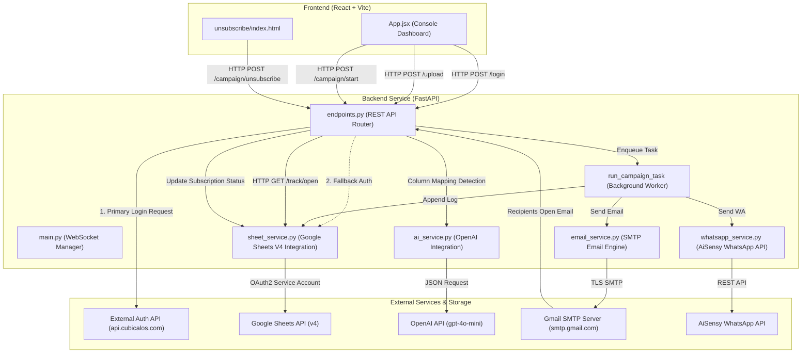

# AI Bulk Messaging System — Master Architecture & Technical Developer Guide

This document provides a comprehensive, end-to-end technical reference for the **AI Bulk Messaging System**. It covers the codebase structure, frontend and backend communication workflows, API endpoint contracts, Google Sheets synchronization, AI detection pipelines, email open tracking, unsubscribe handlers, and deployment configurations.

---

## 1. System Architecture Overview

The application is structured into a **React (Vite)** single-page frontend application and a **FastAPI** Python asynchronous backend service.



---

## 2. Directory & Repository Structure

```
Cube_AI (GMass)/
├── backend/
│   ├── app/
│   │   ├── api/
│   │   │   └── endpoints.py         # REST API endpoints & background execution tasks
│   │   ├── services/
│   │   │   ├── ai_service.py        # OpenAI GPT-4o-mini header mapping & text rewriting
│   │   │   ├── email_service.py     # SMTP mailer with tracking pixel & unsubscribe link
│   │   │   ├── sheet_service.py     # Google Sheets API read/write/append operations
│   │   │   └── whatsapp_service.py  # AiSensy WhatsApp API integration
│   │   └── main.py                  # FastAPI app initialization, CORS, and WebSockets
│   ├── .env                         # Server environment variables & secret keys
│   ├── requirements.txt             # Python dependencies
│   └── service_account.json         # Google Cloud Service Account Credentials
├── frontend/
│   ├── src/
│   │   ├── App.jsx                  # Main single-page application dashboard
│   │   ├── main.jsx                 # React DOM entry point
│   │   └── index.css                # Global CSS styles & design tokens
│   ├── index.html                   # HTML template
│   ├── package.json                 # Frontend dependencies & scripts
│   └── vite.config.js               # Vite build configuration
├── unsubscribe/
│   └── index.html                   # Standalone recipient unsubscribe interface
├── setup_guide.md                   # Quick setup guide
├── workflow_explanation.md          # Functional workflow document
└── SYSTEM_ARCHITECTURE_DOCUMENTATION.md # Master Technical Documentation (This File)
```

---

## 3. Communication Protocols & Dynamic Base URL Resolution

### 3.1 Frontend API URL Resolution (`App.jsx`)
The frontend uses the `getApiBaseUrl()` utility to dynamically resolve the backend endpoint based on the execution environment:

```javascript
const getApiBaseUrl = () => {
  // 1. Explicit environment variable override
  if (import.meta.env.VITE_API_BASE_URL) {
    return import.meta.env.VITE_API_BASE_URL;
  }
  const hostname = window.location.hostname;
  // 2. Local development
  if (hostname === 'localhost' || hostname === '127.0.0.1') {
    return 'http://localhost:8000/api';
  }
  // 3. Render cloud hosting auto-detection
  if (hostname.includes('.onrender.com')) {
    const backendHost = hostname.replace('frontend', 'backend');
    return `https://${backendHost}/api`;
  }
  // 4. Fallback production backend domain
  return 'https://api.automation.cubemoons.com/api';
};
```

### 3.2 Backend CORS Middleware (`main.py`)
Cross-Origin Resource Sharing is configured to accept requests from explicit production domains, local development ports, and dynamically matched Render subdomains:

```python
origins = [
    "https://api.automation.cubemoons.com",
    "https://automation.cubemoons.com",
    "https://unsubscribe.cubemoons.com",
    "http://localhost:5173",
    "http://127.0.0.1:5173"
]

app.add_middleware(
    CORSMiddleware,
    allow_origins=origins,
    allow_origin_regex=r"https?://(localhost|127\.0\.0\.1)(:\d+)?|https://.*\.onrender\.com",
    allow_credentials=True,
    allow_methods=["*"],
    allow_headers=["*"],
)
```

---

## 4. End-to-End Execution Flow

### 4.1 Authentication Flow
1. Client submits credentials via `POST /api/login`.
2. Backend issues an asynchronous HTTP POST to `https://api.cubicalos.com/api/auth/login`.
3. If external SQL authentication succeeds:
   - User role is parsed (`Admin` vs `User`).
   - A session token is stored in memory (`ACTIVE_SESSIONS[token]`).
4. If external SQL authentication fails or is offline:
   - Fallback: Reads user records from Google Sheet tab `Users` via `read_users_data()`.
   - Validates username and password.

### 4.2 File Upload & AI Column Detection
1. User uploads a `.csv` or `.xlsx` file via `POST /api/upload`.
2. `pandas` parses the file into memory and extracts the column headers and first 3 sample rows.
3. Backend passes header names and sample rows to `ai_service.detect_columns()`.
4. OpenAI `gpt-4o-mini` processes the prompt and returns a JSON mapping identifying:
   - `phone`: Mobile / WhatsApp column
   - `email`: Email address column
   - `name`: Recipient full name column
   - `company`: Company / Organization column
5. Response is returned to the frontend for user review/override.

### 4.3 Campaign Dispatch Workflow
1. User configures campaign options (Platform: `WhatsApp`, `Email`, or `Both`, recipient S.No range, message templates).
2. Client submits `POST /api/campaign/start`.
3. Backend performs initial checks:
   - Auto-generates the next sequential Campaign ID (`CAM001`, `CAM002`, etc.) via `get_next_campaign_id()`.
   - Ensures target sheet headers are intact via `ensure_logs_sheet_headers()`.
   - Fetches previously unsubscribed emails via `check_unsubscribed_emails()`.
4. Campaign task is dispatched to `FastAPI.BackgroundTasks` (`run_campaign_task`).
5. For each selected recipient row:
   - Checks if recipient email is in the `unsubscribed_emails` list. If unsubscribed, status is set to `Skipped (Unsubscribed)`.
   - **WhatsApp Send**: Calls `send_whatsapp_message(phone, message)` -> POST request to AiSensy REST API.
   - **Email Send**:
     - Embeds 1x1 tracking pixel URL: `<BACKEND_URL>/api/track/open/{campaign_id}/{email_hex}`
     - Embeds Unsubscribe URL: `<FRONTEND_URL>/unsubscribe/index.html?email={email_hex}&cid={campaign_id}`
     - Dispatches MIME email via TLS SMTP (`send_email()`).
   - **Logging**: Appends log row to Google Sheets via `append_campaign_log()`.

### 4.4 Email Open Tracking Flow
1. Recipient opens the email in their client.
2. Email client requests the 1x1 tracking pixel image via `GET /api/track/open/{campaign_id}/{hex_email}`.
3. Backend decodes the recipient email.
4. Backend updates in-memory status to `Seen`.
5. Backend issues an asynchronous task to `sheet_service.update_log_status()` to mark the `Details` column as `Seen` in Google Sheets.
6. Returns a 1x1 transparent GIF (`b'GIF89a...'`).

### 4.5 Unsubscribe Flow
1. Recipient clicks the unsubscribe link in their email footer.
2. Browser opens `unsubscribe/index.html`.
3. Recipient submits an unsubscribe reason.
4. Unsubscribe page issues `POST /api/campaign/unsubscribe`.
5. Backend invokes `sheet_service.update_unsubscribe_status()`:
   - `Subscription (Yes / No)` column set to `No`.
   - `Unsubscribe Reason` column updated.
   - `If Other (Reason)` column updated.
6. Invalidates backend `SHEETS_LOGS_CACHE` so future sends immediately skip this recipient.

---

## 5. Module Deep-Dive & API Endpoint Reference

### 5.1 Endpoint Contracts (`backend/app/api/endpoints.py`)

| Endpoint | Method | Auth Required | Description |
| :--- | :--- | :--- | :--- |
| `/api/login` | `POST` | No | Authenticates user via external SQL API with local Google Sheet fallback. |
| `/api/upload` | `POST` | Yes (Bearer) | Parses CSV/Excel files and runs AI column detection. |
| `/api/campaign/start` | `POST` | Yes (Bearer) | Generates Campaign ID and enqueues campaign background task. |
| `/api/campaigns` | `GET` | Yes (Bearer) | Returns list of unique historical and active campaign IDs. |
| `/api/campaign/all/status` | `GET` | Yes (Bearer) | Returns all log rows combined for dashboard rendering. |
| `/api/campaign/{campaign_id}/status` | `GET` | Yes (Bearer) | Returns log entries for a specific campaign ID. |
| `/api/campaign/emails-sent-today` | `GET` | Yes (Bearer) | Returns rolling 24-hour sent email count (Gmail IMAP / Sheet fallback). |
| `/api/track/open/{campaign_id}/{hex_email}` | `GET` | No | Returns transparent 1x1 GIF and updates log status to `Seen`. |
| `/api/campaign/unsubscribe` | `POST` | No | Updates unsubscribe columns in Google Sheets database. |
| `/api/rewrite` | `POST` | Yes (Bearer) | Rewrites custom message content using OpenAI GPT-4o-mini. |
| `/api/users` | `GET` | Yes (Admin) | Returns list of all user records from Google Sheets. |
| `/api/users` | `POST` | Yes (Admin) | Appends a new user record to Google Sheets `Users` tab. |
| `/api/users/{user_id}` | `PUT` | Yes (Admin) | Updates an existing user record. |
| `/api/users/{user_id}` | `DELETE` | Yes (Admin) | Deletes a user record. |

---

### 5.2 Google Sheets Database Service (`backend/app/services/sheet_service.py`)

Google Sheets serves as the database for logs and user management.

#### **12-Column Log Table Schema:**
| Column Letter | Header Name | Description |
| :--- | :--- | :--- |
| **A** | `Campaign ID` | Auto-generated identifier (`CAM001`, `CAM002`, etc.) |
| **B** | `Platform` | Messaging channel (`WhatsApp` or `Email`) |
| **C** | `Recipient Name` | Full name of recipient |
| **D** | `Company Name` | Organization / Firm name |
| **E** | `WhatsApp Number` | Target mobile number |
| **F** | `Email` | Target email address |
| **G** | `Timestamp` | Format: `1 August 2026, 10:15AM` |
| **H** | `Details` | Execution status and open tracking notes (e.g. `Sent`, `Seen: 01 Aug 10:20AM`) |
| **I** | `Generate By` | Username of campaign creator |
| **J** | `Subscription (Yes / No)`| Subscription status (`Yes` or `No`) |
| **K** | `Unsubscribe Reason` | Standard unsubscribe reason selected by recipient |
| **L** | `If Other (Reason)` | Custom reason text if recipient selected "Other" |

#### **Dynamic Tab Resolution (`get_logs_tab_name`):**
To ensure compatibility across different user spreadsheets (e.g. `Sheet1` vs `Logs Data`), the service automatically inspects the spreadsheet metadata:

```python
async def get_logs_tab_name(spreadsheet_id: str = None) -> str:
    """
    Returns 'Logs Data' if present, otherwise defaults to the first sheet tab (e.g. 'Sheet1').
    Results are cached per spreadsheet ID to optimize API overhead.
    """
```

---

### 5.3 AI Service (`backend/app/services/ai_service.py`)

Provides integration with OpenAI's `gpt-4o-mini` model with lazy client initialization:

```python
def get_openai_client():
    api_key = os.getenv("OPENAI_API_KEY")
    if not api_key:
        return None
    try:
        return openai.OpenAI(api_key=api_key)
    except Exception as e:
        print(f"DEBUG: Failed to initialize OpenAI client: {e}")
        return None
```

- **`detect_columns(columns, sample_rows)`**: Uses JSON mode prompting to map arbitrary dataset headers to normalized keys (`phone`, `email`, `name`, `company`).
- **`rewrite_message(message, tone)`**: Adjusts draft messaging to specified tones (e.g. `professional`, `persuasive`, `concise`).

---

### 5.4 Email Service (`backend/app/services/email_service.py`)

Handles TLS-encrypted SMTP delivery with multipart MIME structuring:
- **HTML Detection**: Detects if body contains HTML tags; wraps plain text automatically if required.
- **Tracking Pixel Injection**: Appends an invisible `` tag before `</body>`.
- **Unsubscribe Link Footer**: Appends standard compliance unsubscribe links in both HTML and plain-text fallback parts.

---

### 5.5 WhatsApp Service (`backend/app/services/whatsapp_service.py`)

Sends template messages via AiSensy REST API:
- Endpoint: `https://backend.aisensy.com/campaign/t1/api/v2`
- Payload includes `apiKey`, `campaignName`, `destination`, `templateParams`, and `source`.

---

## 6. Environment Configuration (.env Reference)

```env
# OpenAI Configuration
OPENAI_API_KEY=sk-proj-...

# WhatsApp (AiSensy) Configuration
WHATSAPP_API_KEY=eyJhbGciOiJIUzI1Ni...
WHATSAPP_CAMPAIGN_NAME=Cubemoons_Cold_Message

# SMTP Email Configuration
SMTP_SERVER=smtp.gmail.com
SMTP_PORT=587
SMTP_USER=hello@cubemoons.com
SMTP_PASS=your_app_password

# Application URLs & Database Configuration
BACKEND_URL=http://localhost:8000
FRONTEND_URL=http://localhost:5173
LOGS_SPREADSHEET_ID=1Vb3ebEl68jfipAtudmBS_WemsqNeU9OIrl25otB5mU
GOOGLE_APPLICATION_CREDENTIALS=service_account.json
```

---

## 7. Developer Onboarding & Local Setup

### 7.1 Backend Setup
1. Navigate to backend directory:
   ```bash
   cd backend
   ```
2. Create and activate a virtual environment:
   ```bash
   python -m venv .venv
   .venv\Scripts\activate  # Windows
   ```
3. Install dependencies:
   ```bash
   pip install -r requirements.txt
   ```
4. Place `service_account.json` in the `backend/` directory.
5. Start the FastAPI backend server:
   ```bash
   uvicorn app.main:app --reload --port 8000
   ```

### 7.2 Frontend Setup
1. Navigate to frontend directory:
   ```bash
   cd frontend
   ```
2. Install Node dependencies:
   ```bash
   npm install
   ```
3. Start the Vite development server:
   ```bash
   npm run dev
   ```

---

## 8. Summary of Key Architectural Decisions

1. **Lazy Environment Resolution**: Frontend dynamically resolves backend API hostnames without breaking when environment variables are omitted during static builds.
2. **Dynamic Sheet Tab Adaptation**: Google Sheets operations adapt transparently to `Sheet1` or `Logs Data` tab names without requiring user manual tab renaming.
3. **Resilient Authentication**: System uses external SQL API as primary auth and seamlessly falls back to Google Sheet user management if external auth is unreachable.
4. **Non-Blocking Background Campaigns**: Long-running campaign dispatches execute asynchronously via `FastAPI.BackgroundTasks`, keeping the dashboard responsive and immediate.
