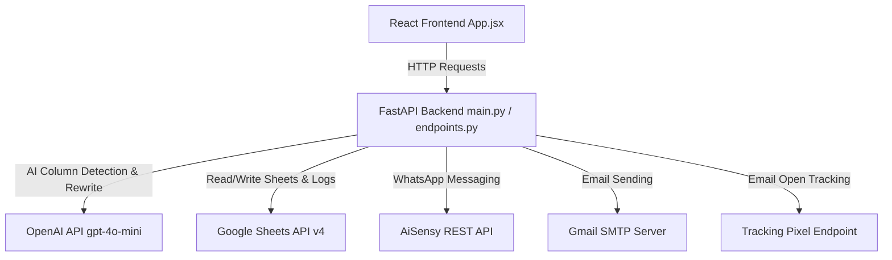
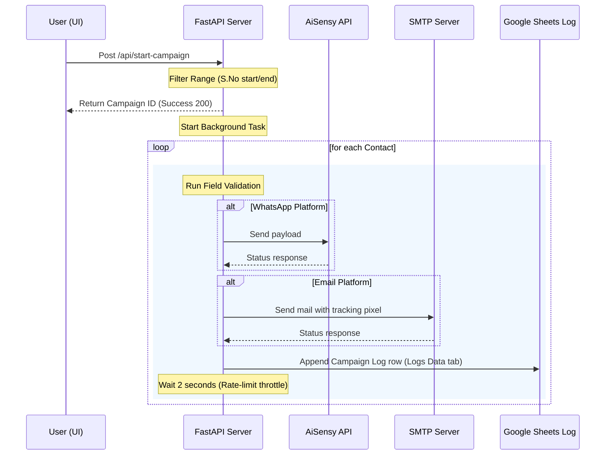

# 🌟 AI Bulk Messaging System: Complete Technical Workflow & Architecture

This document provides a highly detailed explanation of the end-to-end technical workflow, architecture, data flow, and services of the **AI Bulk Messaging System**. It details how the system ingests data, maps columns with AI, executes campaigns (WhatsApp & Email), validates data, logs execution details, and handles sheet updates and Excel exports.

---

## 🏗️ 1. High-Level Architecture Overview

The application is structured as a decoupled **Client-Server Architecture**:



- **Frontend**: Built using **React** with Lucide React icons, Framer Motion animations, and Axios for API communications.
- **Backend**: Built using **FastAPI** (Python), using standard ASGI servers (Uvicorn).
- **Task Queue**: Processes sending routines asynchronously using FastAPI's background tasks (`BackgroundTasks`).

---

## 📥 2. Data Ingestion & Sourcing (How Data is Fetched)

The system supports two independent data sources. Each mode retrieves raw rows and maps them into a uniform structure.

### A. Google Sheets Mode
When a user enters a **Sheet ID**:
1. **Service Account Authentication**: The backend initializes a Google Sheets client using a service account JSON key (`service_account.json`) with `https://www.googleapis.com/auth/spreadsheets` scope.
2. **Access & Dynamic Fetching**:
   - The system calls `service.spreadsheets().get(spreadsheetId)` to find the sheet metadata.
   - It dynamically extracts the title of the **first tab/sheet** in the workbook.
   - It reads all populated values from columns `A` to `Z` (`SheetName!A:Z`) using `service.spreadsheets().values().get(...)`.
3. **Data Structure**:
   - The first row is treated as the **headers** array.
   - The remaining rows are structured as a list of data rows.

> [!IMPORTANT]
> The Google Sheet must be shared with the Service Account email (`audit-ai@recruiterai-492605.iam.gserviceaccount.com`) as a **Viewer** or **Editor** for the system to read and write logging information.

---

### B. Local File Upload Mode
When a user uploads a **CSV** or **Excel (.xlsx, .xls)** file locally:
1. **File Upload**: The file is sent as part of a `multipart/form-data` POST request to the `/api/upload` endpoint.
2. **Pandas Parsing**:
   - If the file ends with `.csv`, it is read using `pd.read_csv()`.
   - Otherwise, it is parsed using `pd.read_excel()` using the `openpyxl` engine.
3. **NaN & Null Sanitization**:
   - Pandas reads blank spreadsheet cells as `NaN` (Not a Number) floating-point objects. 
   - To prevent serialization errors, the backend applies `df = df.fillna("")` to replace all `NaN` values with blank strings (`""`).
4. **Header & Row Construction**:
   - Headers are extracted via `df.columns.tolist()`.
   - Data rows are compiled as strings using list comprehensions: `[[str(x) for x in row] for row in df.values]`.

---

## 🤖 3. AI Column Mapping & Sanitization

To ensure data variables are mapped to their matching functions without requiring manual mapping inputs:

### A. Dynamic Column Mapping
1. When a file is uploaded, the column names and a sample of the first 3 rows of data are sent to the `/api/upload` endpoint.
2. The endpoint calls the AI column detection service (`detect_columns`), which makes a call to OpenAI's `gpt-4o-mini` model using a JSON-response format:
   ```json
   {
     "phone": "Detect Mobile/Phone Header",
     "email": "Detect Email Header",
     "name": "Detect Name Header"
   }
   ```
3. If the AI service fails or times out, it gracefully falls back to a dictionary of empty strings (`{"phone": "", "email": "", "name": ""}`) to prevent server crashes.

### B. Fallback Header Indexing
If the AI-detected mapping is missing keys or has wrong column names, the backend runs a case-insensitive fallback loop to find target column indexes inside the header row:
- Look for standard column labels like `Phone`, `Mobile`, `Number`, `Email`, `Mail`, `Name`, `Client`, `Recipient`.

---

## 🚀 4. Campaign Execution Workflow (Email & WhatsApp)

Once the user clicks **"Launch Campaign"**:



### A. Template Personalization
The message templates support personalization variables. For each contact, the engine scans the message string and replaces placeholders:
- `{name}` is replaced with the contact's name (extracted from the detected name column).
- Additional column-based dynamic custom variable replacement is supported.

---

### B. WhatsApp Service (AiSensy Integration)
1. **Address Sanitization**:
   - The phone value is stripped of empty spaces, hyphens (`-`), and prepended plus symbols (`+`).
   - If the cleaned number length is exactly 10 digits, it automatically prepends the country code `"91"` (India) to format it correctly for international routing.
2. **Payload Construction**:
   Constructs a REST payload for the AiSensy API:
   ```json
   {
     "apiKey": "WHATSAPP_API_KEY",
     "campaignName": "WHATSAPP_CAMPAIGN_NAME",
     "destination": "CleanedPhoneNumber",
     "userName": "ContactName",
     "templateParams": [],
     "source": "API"
   }
   ```
3. **API Dispatch**: Dispatches an HTTP POST request to `https://backend.aisensy.com/campaign/t1/api/v2`. If the status code returned is `200`, `201`, or `202`, it returns `"Sent"`. Otherwise, it catches the exact error response body returned by the API.

---

### C. Email Service (SMTP, Tracking, and Limits)
1. **Open/Read Tracking**:
   - If a `tracking_url` is provided, the backend injects an invisible tracking pixel (``) into the email body.
   - If the email body contains HTML elements, it inserts it right before the `</body>` tag.
   - If it is plain text, it wraps the message in HTML and appends the pixel at the end.
2. **SMTP Dispatch**:
   - The email is sent using Python's `smtplib` and `email.mime` modules.
   - Establishes a TLS session over Port `587` to the configured `SMTP_SERVER` (e.g. `smtp.gmail.com`).
   - Authenticates using `SMTP_USER` and `SMTP_PASS` (App Password).
   - Generates an alternative MIME structure supporting both HTML rendering and plain-text fallbacks.
3. **Open-Tracking Capture**:
   - When the recipient opens the email, the client requests the tracking URL: `/api/campaign/track-open?campaign_id=...&email=...`.
   - The FastAPI backend updates the status of that email row to `"Seen"` and appends the timestamp.
   - It returns a transparent 1x1 GIF binary response to satisfy the browser request.

---

## 🛡️ 5. Validation & Error Handling Logic

Before attempting to connect to external servers, the backend runs a series of strict validation checks to log descriptive statuses:

| Field Checked | Condition / Failure Trigger | Logged Reason | Action |
| :--- | :--- | :--- | :--- |
| **WhatsApp Column** | Header key not found in data headers | `Failed: WhatsApp column not found` | Skip Row |
| **Email Column** | Header key not found in data headers | `Failed: Email column not found` | Skip Row |
| **Phone Number** | Cleaned string is blank/empty | `Failed: Phone number is empty` | Skip Row |
| **Phone Length** | Cleaned string is less than 10 characters | `Failed: Invalid phone number length` | Skip Row |
| **Email Address** | Cleaned string is blank/empty | `Failed: Email address is empty` | Skip Row |
| **Email Format** | Does not match regex `^[a-zA-Z0-9_.+-]+@[a-zA-Z0-9-]+\.[a-zA-Z0-9-.]+$` | `Failed: Invalid email address format` | Skip Row |
| **SMTP Failures** | SMTP authentication or transmission exception | `Failed: [Exact Exception Message]` | Log Fail |
| **AiSensy Failures** | Non-200 response from API endpoint | `Failed: [API JSON Error Body]` | Log Fail |

---

## 📝 6. Logging & Monitoring System (Google Sheets + Memory)

The system records logs using a dual-logging pattern:

### A. In-Memory Logs (Fast UI Rendering)
- Active campaign runs are stored in-memory inside a `campaign_manager` dictionary.
- Polling requests from the frontend check this memory state first to update progress logs within milliseconds.

### B. Google Sheets Logs (Persistent Database)
- If a Google Sheet ID is configured (either from user input or fallback `LOGS_SPREADSHEET_ID` in `.env`), log rows are written to a tab called **"Logs Data"**.
- **Self-Healing Tab**: If the "Logs Data" tab is missing from the Google Sheet, the system calls `batchUpdate` to create it dynamically with headers:
  `["Campaign ID", "Platform", "Recipient Name", "WhatsApp Number", "Email", "Timestamp", "Details", "Generate By"]`
- For each contact processed, a row is appended using `values().append()`. The `Details` cell stores `Status: Reason` (e.g. `Failed: Email address is empty` or `Seen`).

---

## 📊 7. Excel Export & Styling Engine

The system allows downloading a clean, custom-styled Excel sheet of logs on a per-campaign basis.

1. **GET `/api/campaign/{campaign_id}/export`**:
   - The endpoint fetches logs for the given `campaign_id` using the Google Sheets log reader + memory lookup.
2. **Pandas Compilation**:
   - Converts the results list into a structured DataFrame.
3. **Openpyxl Header Styling**:
   - Accesses the underlying sheet workbook.
   - Applies formatting so that row 1 (the header row) has **bold white text** (`#FFFFFF`) with a **corporate dark steel blue background fill** (`#1F4E78`).
4. **Column Auto-Width Calculation**:
   - Scans the content cells of each column to calculate the length of the longest value.
   - Adjusts column dimensions using `worksheet.column_dimensions[col_letter].width = max(max_len + 3, 12)`. This prevents truncation and handles long email addresses elegantly.
5. **Streaming Response**: Streams the Excel file from an in-memory `BytesIO` buffer as a file download.

---

## 🔒 8. Security & Limit Protocols

- **Session Authentication**: JWT-like session token checking via `Depends(get_current_user)` on all campaign creation and fetch endpoints.
- **Email Limit Throttle**:
  - The endpoint `/campaign/emails-sent-today` counts the rolling 24-hour emails sent by connecting to the Gmail Sent folder via IMAP (`imap.gmail.com`).
  - If IMAP is inaccessible, it falls back to parsing log entries from Google Sheets within the past 24 hours.
  - The frontend automatically disables the "Launch Campaign" button if the daily email count reaches or exceeds `1000`.
- **Throttling Delays**: The loop in `run_campaign_task` waits **2 seconds** (`await asyncio.sleep(2)`) between sending to each contact to simulate human-like behavior, protecting SMTP and WhatsApp sender reputations.
